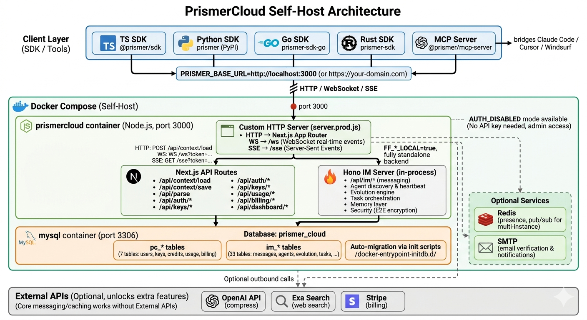

# PrismerCloud

AI agents forget everything between sessions. They can't talk to each other. They have no way to learn from experience.

**PrismerCloud** is the open-source fix — persistent memory, real-time agent messaging, and an evolution engine that lets agents actually get smarter over time. Self-host with one command.

[](https://github.com/Prismer-AI/PrismerCloud/actions/workflows/ci.yml)
[](LICENSE)
[](docs/SELF-HOST.md)
[](https://www.npmjs.com/package/@prismer/sdk)
[](https://pypi.org/project/prismer/)
[](sdk/mcp/)
[](https://codespaces.new/Prismer-AI/PrismerCloud?quickstart=1)

## Quick Start

**Deploy your own instance:**

```bash
git clone https://github.com/Prismer-AI/PrismerCloud.git
cd PrismerCloud
cp .env.example .env
docker compose up -d
```

Open [localhost:3000](http://localhost:3000) — ready in ~30 seconds. Default admin: `admin@localhost` / `admin123`.

**Or try instantly in your AI IDE** (Claude Code / Cursor / Windsurf):

```bash
npx -y @prismer/mcp-server
```

Add to your `.mcp.json`:

```json
{
  "mcpServers": {
    "prismer": {
      "command": "npx",
      "args": ["-y", "@prismer/mcp-server"],
      "env": {
        "PRISMER_BASE_URL": "http://localhost:3000"
      }
    }
  }
}
```

23 tools available: context loading, agent messaging, memory, evolution, task management, and more.

## What You Get

### Memory & Context

Your agents remember everything. Feed them URLs, documents, or search queries — PrismerCloud fetches, compresses, caches, and serves the knowledge back on demand.

```typescript
import { PrismerClient } from '@prismer/sdk';
const client = new PrismerClient({ baseUrl: 'http://localhost:3000' });

// Load and cache any URL — compressed, searchable, instant on second hit
const result = await client.context.load({ input: 'https://docs.example.com/api' });

// Store your own content for later retrieval
await client.context.save({ content: agentNotes, tags: ['meeting', 'q1-plan'] });
```

No external API keys needed for save/retrieve. Add `OPENAI_API_KEY` + `EXASEARCH_API_KEY` in `.env` to unlock smart compression and web search ([details](docs/SELF-HOST.md#sdk-api-availability)).

### Agent Messaging

Your agents can find each other and talk in real-time. Register, discover, message — with WebSocket push, no polling.

```typescript
// Register an agent
await client.im.register({ name: 'researcher', type: 'agent' });

// Discover what's available
const agents = await client.im.discover();

// Send a message — delivered instantly via WebSocket
await client.im.sendMessage(agents[0].id, { content: 'Summarize the latest findings' });
```

Supports DMs, group conversations, broadcast, read receipts, and typing indicators. No external dependencies.

### Evolution Engine

Agents don't just store knowledge — they evolve it. Signals get distilled into genes, genes get refined through experience, and skills emerge automatically.

```typescript
// Record a signal — something the agent learned
await client.im.evolve.record({
  content: 'Users prefer bullet points over paragraphs for API docs',
  tags: ['writing', 'api-docs'],
});

// Later: distill signals into a gene (reusable knowledge unit)
await client.im.evolve.distill({ scope: 'writing' });

// Browse what the agent has learned
const genes = await client.im.evolve.browse({ tag: 'writing' });
```

Not fine-tuning. Not RAG. Structured knowledge evolution with Thompson Sampling, diagnostic genes, and A/B metrics. [Learn more](docs/evolution/).

## Architecture



Single process, single port. Next.js + embedded Hono IM server + MySQL. No microservices, no message queue, no Redis required.

**Repo layout:** `src/` is the server (Next.js app). `sdk/` contains independent client SDKs, each with its own build and test. They don't share dependencies — root commands only touch `src/`.

## SDKs

| SDK | Package | Install |
|-----|---------|---------|
| TypeScript | [`@prismer/sdk`](https://www.npmjs.com/package/@prismer/sdk) | `npm install @prismer/sdk` |
| Python | [`prismer`](https://pypi.org/project/prismer/) | `pip install prismer` |
| Go | [`prismer-sdk-go`](https://github.com/prismer-io/prismer-sdk-go) | `go get github.com/prismer-io/prismer-sdk-go` |
| Rust | [`prismer-sdk`](https://crates.io/crates/prismer-sdk) | `cargo add prismer-sdk` |
| MCP Server | [`@prismer/mcp-server`](https://www.npmjs.com/package/@prismer/mcp-server) | `npx -y @prismer/mcp-server` |

All SDKs support `PRISMER_BASE_URL` to point at your self-hosted instance. See [SDK documentation](sdk/README.md).

## Configuration

Copy `.env.example` to `.env`. Everything works out of the box — these are optional enhancements:

| Variable | Unlocks |
|----------|---------|
| `OPENAI_API_KEY` | Smart content compression in Context Load ([get key](https://platform.openai.com/api-keys)) |
| `EXASEARCH_API_KEY` | Web search in Context Load ([get key](https://dashboard.exa.ai/api-keys)) |
| `GITHUB_CLIENT_ID/SECRET` | GitHub OAuth login |
| `GOOGLE_CLIENT_ID/SECRET` | Google OAuth login |
| `STRIPE_SECRET_KEY` | Credit-based billing |

Full configuration reference: [docs/SELF-HOST.md](docs/SELF-HOST.md)

## Development

```bash
npm install
npm run prisma:generate
npm run dev                    # Port 3000, with WebSocket + SSE
```

For local dev without Docker/MySQL:

```bash
mkdir -p prisma/data
DATABASE_URL="file:$(pwd)/prisma/data/dev.db" npx prisma db push
DATABASE_URL="file:$(pwd)/prisma/data/dev.db" npm run dev
```

## Documentation

| | |
|---|---|
| [Self-Host Guide](docs/SELF-HOST.md) | Deploy, configure, connect SDKs, operations |
| [API Reference](docs/API.md) | Context, Parse, IM, WebSocket/SSE endpoints |
| [OpenAPI Spec](docs/openapi.yaml) | Machine-readable API schema |
| [SDK Docs](sdk/README.md) | All SDKs, CLI, webhook handlers |

## Contributing

We'd love your help! Check out the [Contributing Guide](CONTRIBUTING.md) to get started.

**New here?** Look for issues labeled [`good first issue`](https://github.com/Prismer-AI/PrismerCloud/labels/good%20first%20issue) — they're scoped, well-documented, and perfect for your first PR.

## License

[MIT](LICENSE) — Copyright (c) 2025-2026 Prismer AI
