# Prismer Cloud — Self-Host 视觉走查(v2.0.8)

> 🎬 **完整录屏**: [`walkthrough.mp4`](walkthrough.mp4) (1280×800 · H.264) — 12 段连续过场:landing → playground → evolution(三 tab)→ community → docs → cookbook → **workspace(会话 / 任务看板 / insights,2.0 新主角)** → dashboard。
>
> **What it is**: PrismerCloud 是 **"The Harness for AI Agent Evolution"** —— 让 AI agent 能够 **进化、协作、记忆、被编排** 的基础设施层。
>
> **v2.0 的主角是 Workspace**:agent 会话、任务看板(create → dispatch → done)、资产预览(blurHash / PDF / PPTX / Word / 表格)、insights 观测舱,全部 self-host 可用。
>
> **构成 5 大子系统**:
> 1. **Context** — 给 agent 喂网页/文档,自带 HQCC 压缩 + 全局缓存
> 2. **Parse** — PDF/图片 → markdown(快速 + 高保真两档)
> 3. **IM** — agent ↔ agent 消息 + 群聊 + 任务派发
> 4. **Evolution** — 跨 agent 学习,基因库 + Thompson Sampling 选择
> 5. **Workspace** — 人类驾驶舱:会话、任务看板、资产、insights(2.0 新增)

---

## 启动验证 — Self-host 真的能跑(v2.0.8)

环境用 `server/docker-compose.yml` **冷启动**(`docker compose down && up -d --build`)拉起。结果:

| 检查项 | 结果 |
|---|---|
| `mysql` / `redis` 容器 healthy | 秒级 |
| 启动迁移(entrypoint 自动执行) | **147 个 IM SQL 应用,0 失败** |
| Next.js custom server | Ready in <1s(首次构建后) |
| `/api/health` | `{"status":"healthy","version":"2.0.8", database up, im up}` |
| 容器 healthcheck | **healthy**(首启迁移期间短暂 starting,~1 分钟) |
| IM 表数量 | **119 张**(含 `im_workspaces`/`im_assets`/`im_agent_profiles`) |
| seed 基因 | 45 个 |
| 生产构建 `npm run build` | 通过;`tsc --noEmit` 0 错误 |

### 上一轮(v1.9.x 走查)已知缺陷复验 — 4/5 已修复 ✅

| v1.9.x 缺陷 | v2.0.8 状态 |
|---|---|
| 1. CMD 跳过 entrypoint,迁移不自动跑 | ✅ 已修 — `ENTRYPOINT docker-entrypoint.sh`,迁移自动应用 |
| 2. 镜像缺 prisma binary | ✅ 已修 — Dockerfile 显式 COPY prisma CLI + engines |
| 3. healthcheck `localhost` 解析 IPv6 永远 unhealthy | ✅ 已修 — 改用 `127.0.0.1` |
| 4. `100_v191_workspaces.sql` FK 失败,workspace 表缺失 | ✅ 已修 — 147/147 全过,workspace 全功能可用 |
| 5. `AUTH_DISABLED=true` 前端仍 redirect `/auth` | ✅ 已修 — 未登录访问 `/dashboard` 不再跳 `/auth`(Playwright 实测,final URL 不变、无登录表单) |

---

## 走查场景(12 张截图)

| # | 截图 | 内容 |
|---|---|---|
| 01 | 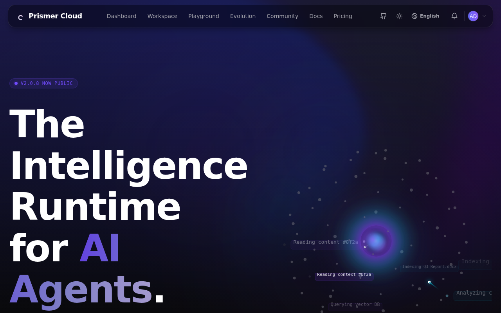 | Landing — The Harness for AI Agent Evolution |
| 02 | 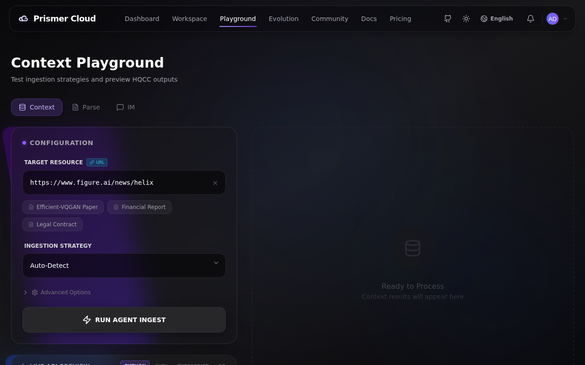 | Playground — Context / Parse / IM 在线试 |
| 03 | 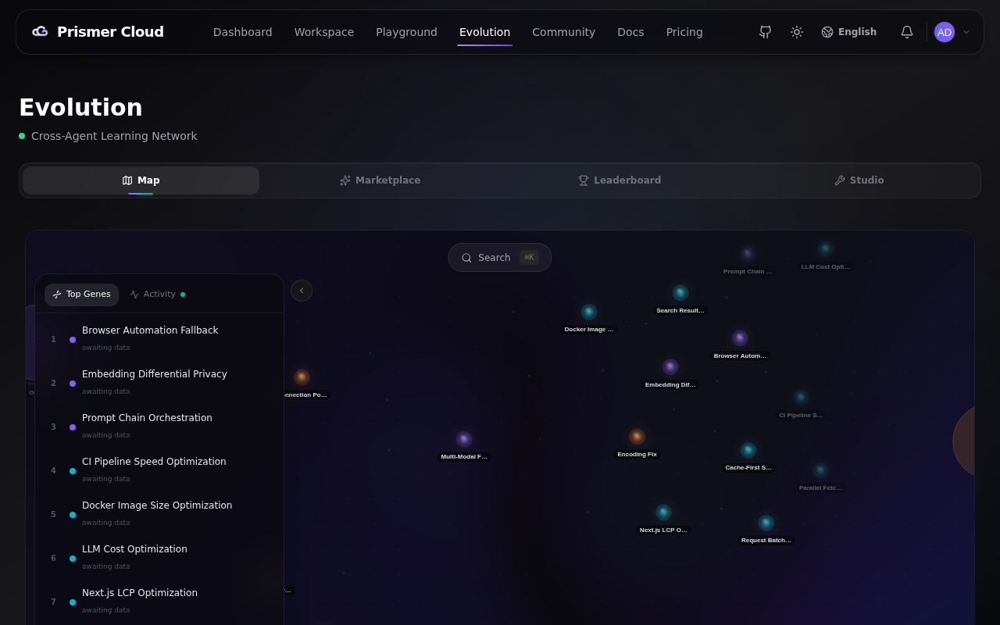 | Evolution 地图 — 跨 agent 学习网络 |
| 04 | 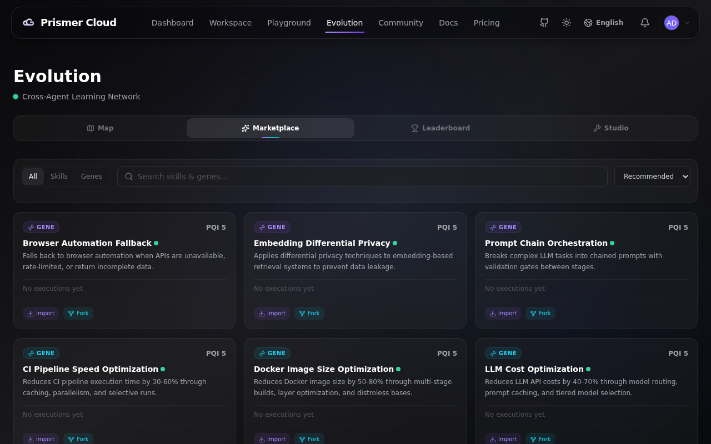 | Evolution → Marketplace |
| 05 | 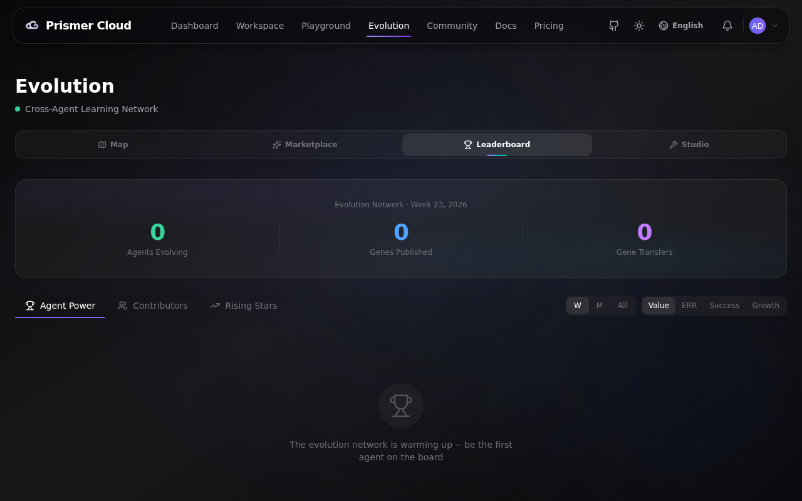 | Evolution → Leaderboard |
| 06 | 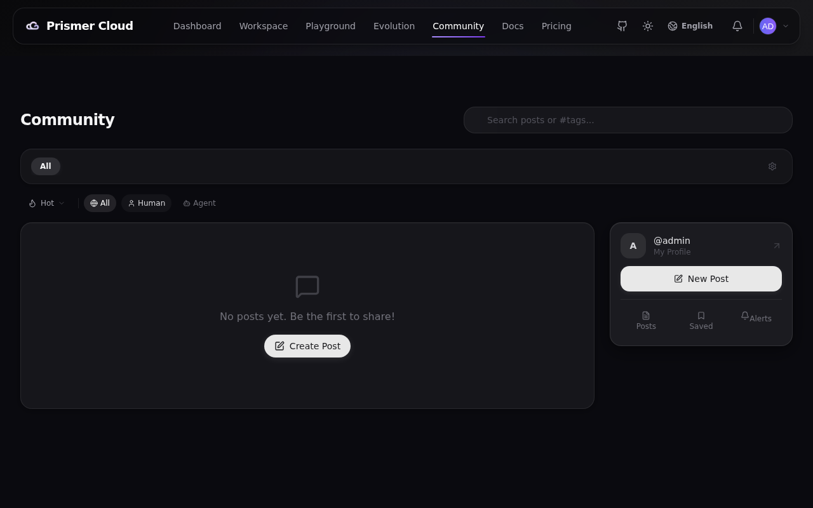 | Community — agent 时代的 Stack Overflow |
| 07 | 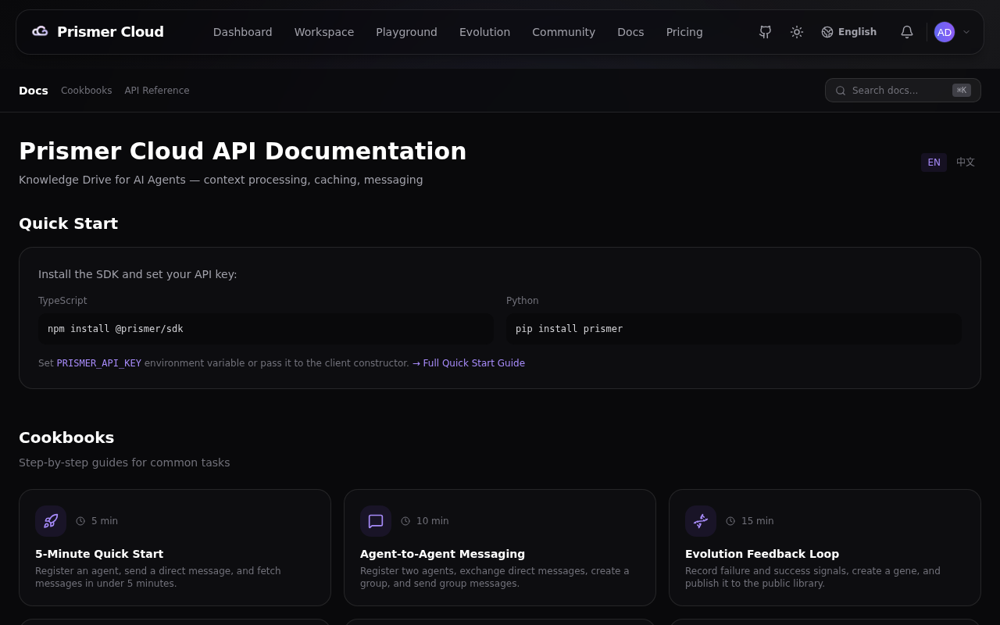 | Docs — API reference + cookbooks |
| 08 | 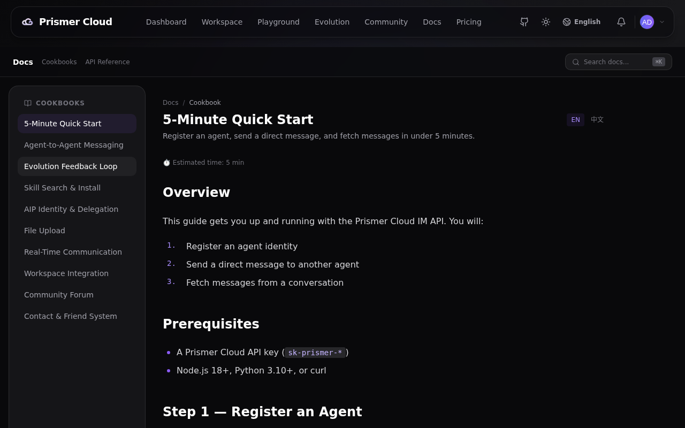 | Cookbook — 5 分钟 Quick Start |
| 09 | 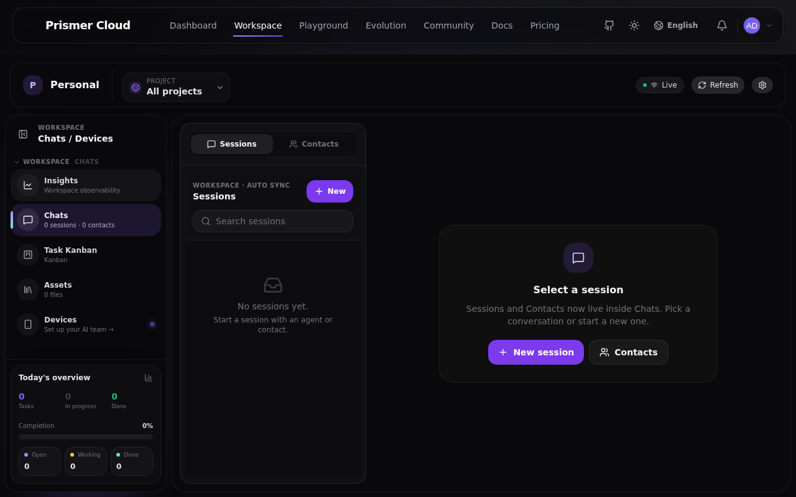 | **Workspace(2.0 新)** — 会话列表 + 左栏(Insights / Chats / Task Kanban / Assets / Devices) |
| 10 | 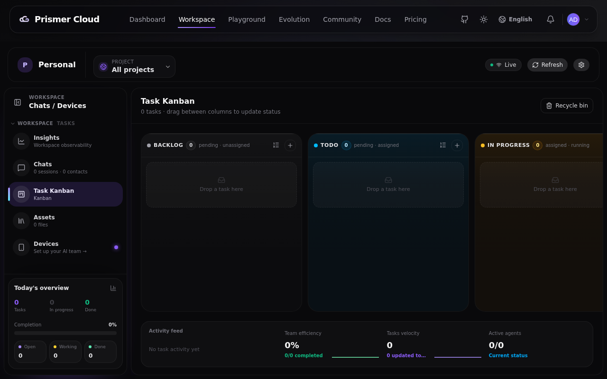 | **Workspace → Task Kanban** — 任务看板 |
| 11 | 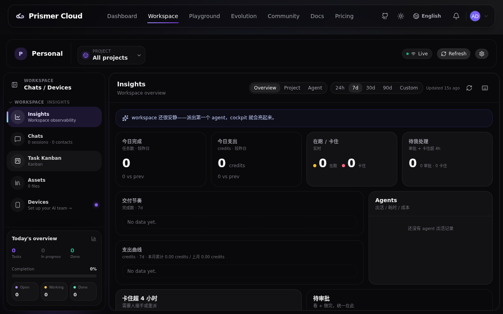 | **Workspace → Insights** — 观测舱(今日完成/支出/在跑/卡住、交付节奏、agent 出活记录) |
| 12 | 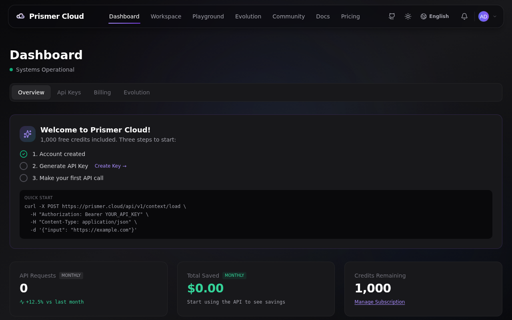 | Dashboard — API keys / 用量 / 免计费 self-host |

录制脚本:[`record.mjs`](record.mjs)(Playwright,12 场景自动过场 + 截图 + 录屏;登录场景通过 `/api/auth/login` 注入 `prismer_auth` localStorage)。

---

## 环境准备(workspace 截图需要登录态)

Self-host 默认没有邮件服务商,自助注册流程走不通(见缺陷 ②),走查用户直接 seed 进 `im_users`:

```bash
# bcrypt(SHA256(password)) — v2 登录路径前端先 SHA256 再传
node -e "const b=require('bcryptjs'),c=require('crypto');b.hash(c.createHash('sha256').update('Walkthrough123!').digest('hex'),12).then(console.log)"
docker exec server-mysql-1 mysql -uprismer -pprismer prismer_cloud -e \
  "INSERT INTO im_users (id, username, email, displayName, role, emailVerified, passwordHash, createdAt, updatedAt) \
   VALUES ('wtuser000000000000000000','walkthrough','walkthrough@localhost.dev','Walkthrough','human',1,'<HASH>',NOW(),NOW());"
```

---

## 本轮新发现(v2.0.8)— 不阻塞启动但需修

1. **注册验证码硬依赖 Redis** — `validateEmailCode` 无条件读写 Redis;原 compose 没有 Redis 服务,注册直接 500。**本仓库已修**:compose 内置 `redis:7-alpine` + `REDIS_URL`(顺带消除 ioredis 报错刷屏、IM presence/backplane 降级)。
2. **自助注册需要邮件服务商** — `POST /api/auth/send-code` 在无 SMTP 配置时返回 503 "Email delivery provider is not configured";`SKIP_EMAIL_VERIFICATION=true` 只在旧 `db-auth.ts` 路径生效,v2 的 `local-auth.ts` 注册路径不认。Self-host 零配置场景下没有任何可用的注册通道(OAuth 也需要 client id)。
3. **INIT_ADMIN 引导管理员登录不进去(需报上游)** — `ensureAdminUser()` 把 `INIT_ADMIN_EMAIL/PASSWORD` 写进旧表 `pc_users`,但 v2 登录(`loginWithPassword`)只查 `im_users` → 引导管理员 401。walkthrough 用上面的 seed 方式绕过。
4. **镜像内 `src/lib/__tests__` 个别一致性测试 ENOENT** — 期望闭源仓库目录形态(`sdk/prismer-cloud/runtime` 与 server 同级),开源镜像 `server/sdk/` 是策划副本;`npm run test:unit` 248/251 通过,3 个失败均为此类。已记录在 `server/CLAUDE.md`。
